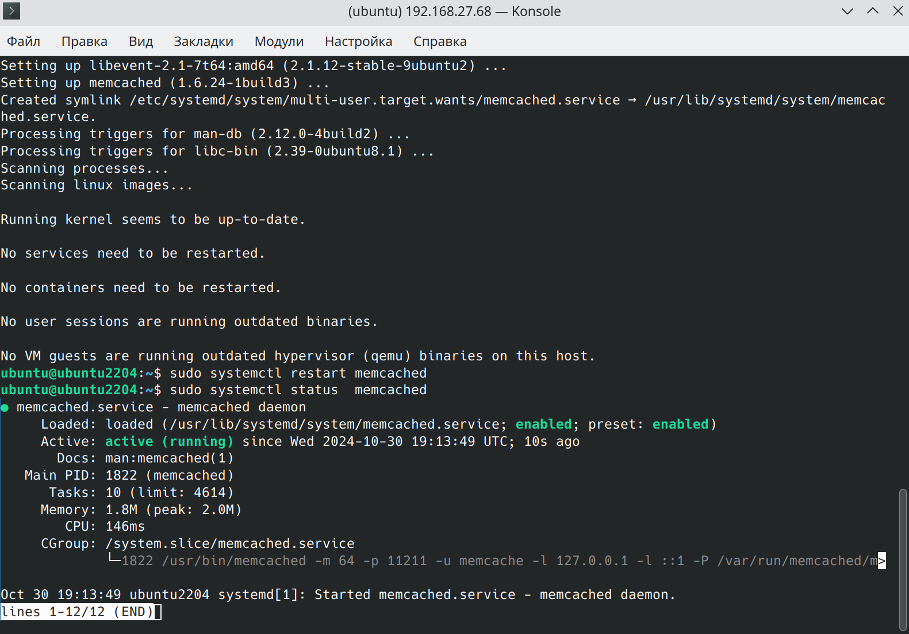
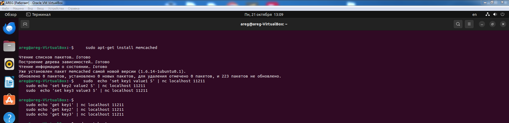

# Домашнее задание к занятию «Кеширование Redis/memcached»    - `Дмитрий Демченко`

### Задание 1. Кеширование 

Приведите примеры проблем, которые может решить кеширование. 

### Решение

Кеширование используется для повышения производительности и эффективности работы приложений и веб-сервисов. Вот несколько распространенных проблем, которые могут быть решены с помощью кеширования:
1. Снижение нагрузки на базу данных: Каждый запрос к базе данных требует значительных ресурсов процессора и памяти. Часто повторяющиеся запросы могут сильно замедлить работу приложения и базы данных. Кеш позволяет временно хранить часто запрашиваемые данные в памяти, уменьшая количество обращений к базе данных.
2. Уменьшение времени ответа: Обращения к базам данных могут занимать много времени из-за сложных SQL-запросов, сетевых задержек и других факторов. Кеш позволяет быстро предоставлять пользователям уже имеющиеся данные без необходимости их повторного получения из базы данных.
3. Оптимизация доступа к удаленным ресурсам: Доступ к внешним сервисам, таким как API, может занять значительное время из-за сетевой задержки. Кеширование позволяет временно сохранять результаты этих запросов локально, что ускоряет дальнейшие обращения.
4. Улучшение масштабируемости: По мере роста количества пользователей нагрузка на систему увеличивается. Кеширование помогает распределять нагрузку между несколькими узлами, что делает систему более устойчивой к пиковым нагрузкам.
5. Сокращение использования ресурсов: Регулярные запросы к базам данных или внешним службам могут потребовать большого объема ресурсов. Кеширование снижает необходимость в использовании этих ресурсов, освобождая их для других задач.
Эти примеры показывают, как кеширование может улучшить производительность и эффективность работы различных систем и приложений.

---

### Задание 2. Memcached

Установите и запустите memcached.

---

### Задание 3. Удаление по TTL в Memcached

Запишите в memcached несколько ключей с любыми именами и значениями, для которых выставлен TTL 5. 

---

### Задание 4. Запись данных в Redis

Запишите в Redis несколько ключей с любыми именами и значениями. 

