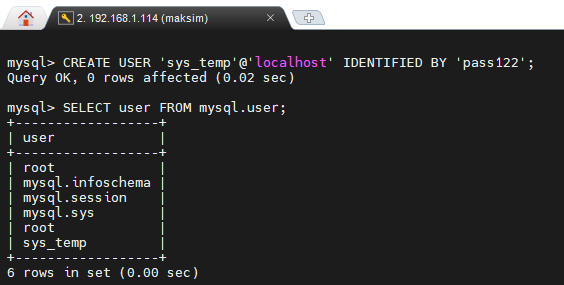
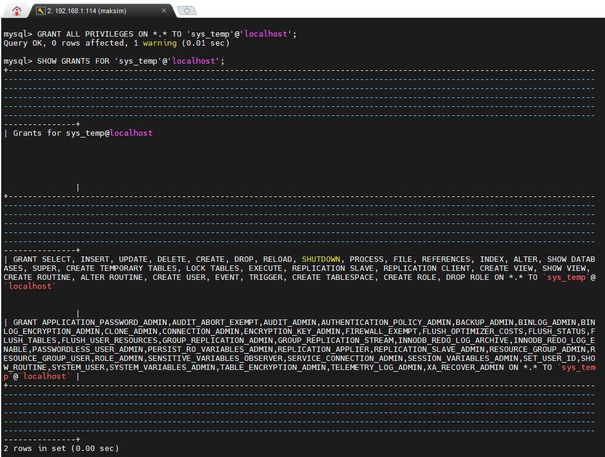
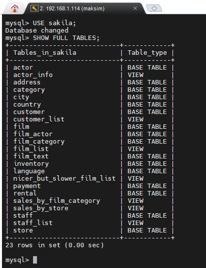
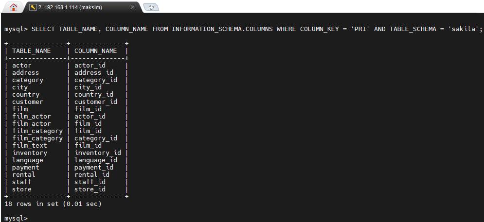

# Домашнее задание к занятию «Работа с данными (DDL/DML)»  - `Дмитрий Демченко`

### Задание 1
1.1. Поднимите чистый инстанс MySQL версии 8.0+. Можно использовать локальный сервер или контейнер Docker.

#### Ответ 1.1

```bash
docker run --name mysql-instance-12-2 -e MYSQL_ROOT_PASSWORD=i122 -d mysql:8.0
```

1.2. Создайте учётную запись sys_temp.

#### Ответ 1.2

```sql
CREATE USER 'sys_temp'@'localhost' IDENTIFIED BY 'pass122';
```

1.3. Выполните запрос на получение списка пользователей в базе данных. (скриншот)

#### Ответ 1.3

```sql
SELECT user FROM mysql.user;
```



1.4. Дайте все права для пользователя sys_temp.

#### Ответ 1.4

```sql
GRANT ALL PRIVILEGES ON *.* TO 'sys_temp'@'localhost';
```

1.5. Выполните запрос на получение списка прав для пользователя sys_temp. (скриншот)

#### Ответ 1.5

```sql
SHOW GRANTS FOR 'sys_temp'@'localhost';
```



1.6. Переподключитесь к базе данных от имени sys_temp.

Для смены типа аутентификации с sha2 используйте запрос: 
```sql
ALTER USER 'sys_test'@'localhost' IDENTIFIED WITH mysql_native_password BY 'password';
```

#### Ответ 1.6

```bash
docker exec -it mysql-instance-12-2 mysql -u sys_temp -p
```

```sql
ALTER USER 'sys_temp'@'localhost' IDENTIFIED WITH mysql_native_password BY 'pass122';
```

1.6. По ссылке https://downloads.mysql.com/docs/sakila-db.zip скачайте дамп базы данных.

1.7. Восстановите дамп в базу данных.

#### Ответ 1.7

```sql
SOURCE /tmp/sakila-schema.sql;
SOURCE /tmp/sakila-data.sql;
```

1.8. При работе в IDE сформируйте ER-диаграмму получившейся базы данных. При работе в командной строке используйте команду для получения всех таблиц базы данных. (скриншот)

#### Ответ 1.8

```sql
USE sakila;
SHOW FULL TABLES;
```



### Задание 2
Составьте таблицу, используя любой текстовый редактор или Excel, в которой должно быть два столбца: в первом должны быть названия таблиц восстановленной базы, во втором названия первичных ключей этих таблиц. Пример: (скриншот/текст)
```
Название таблицы | Название первичного ключа
customer         | customer_id
```

Ответ:

```sql
SELECT TABLE_NAME, COLUMN_NAME 
FROM INFORMATION_SCHEMA.COLUMNS
WHERE COLUMN_KEY = 'PRI' 
  AND TABLE_SCHEMA = 'sakila';
```

