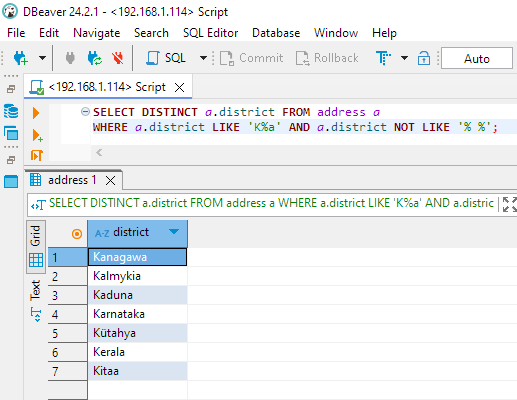
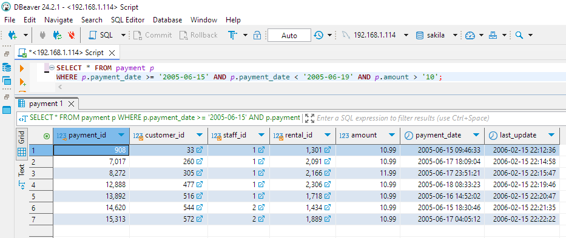
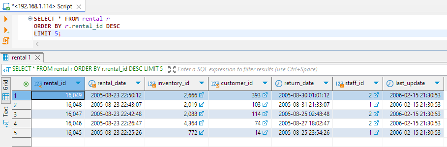
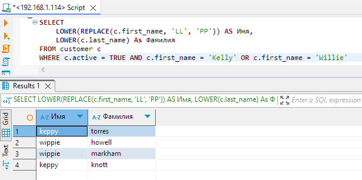

# Домашнее задание к занятию «SQL. Часть 1»  - `Дмитрий Демченко`

### Задание 1

Получите уникальные названия районов из таблицы с адресами, которые начинаются на “K” и заканчиваются на “a” и не содержат пробелов.

#### Ответ 1

```sql
SELECT DISTINCT a.district FROM address a
WHERE a.district LIKE 'K%a' AND a.district NOT LIKE '% %';
```



### Задание 2

Получите из таблицы платежей за прокат фильмов информацию по платежам, которые выполнялись в промежуток с 15 июня 2005 года по 18 июня 2005 года **включительно** и стоимость которых превышает 10.00.


#### Ответ 2

```sql
SELECT p.payment_date, p.amount FROM payment p
WHERE p.payment_date >= '2005-06-15' AND p.payment_date < '2005-06-19' AND p.amount > '10';
```



### Задание 3

Получите последние пять аренд фильмов.

#### Ответ 3

```sql
SELECT * FROM rental r 
ORDER BY r.rental_id DESC
LIMIT 5;
```



### Задание 4

Одним запросом получите активных покупателей, имена которых Kelly или Willie. 

Сформируйте вывод в результат таким образом:
- все буквы в фамилии и имени из верхнего регистра переведите в нижний регистр,
- замените буквы 'll' в именах на 'pp'.

#### Ответ 4

```sql
SELECT
    LOWER(REPLACE(c.first_name, 'LL', 'PP')) AS Имя,
    LOWER(c.last_name) As Фамилия
FROM customer c
WHERE c.active = TRUE AND c.first_name = 'Kelly' OR c.first_name = 'Willie'
```



